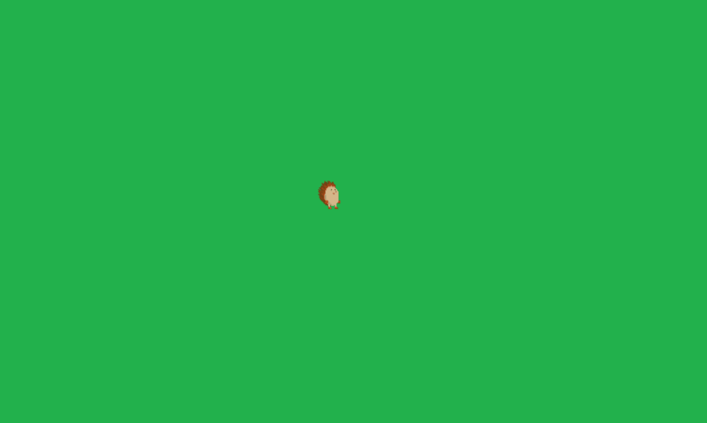
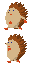
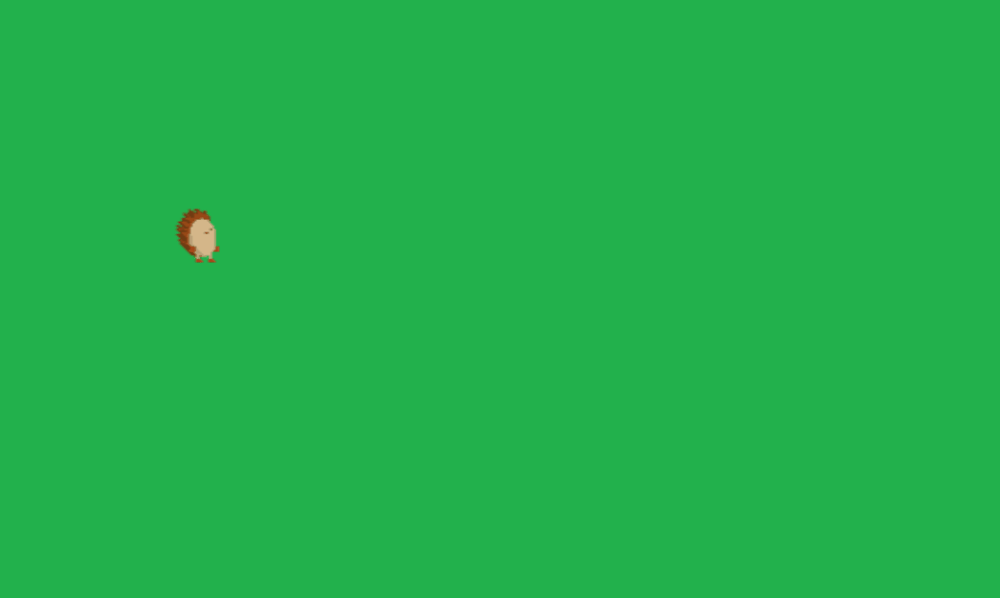
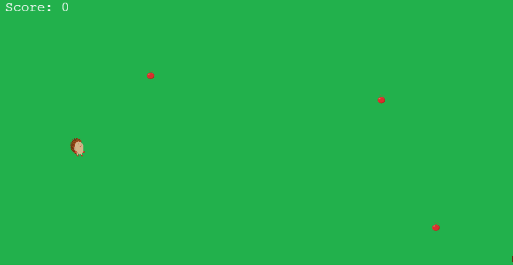

# Build your first shinyphaser game

This vignette walks through a minimal **shinyphaser** game where a
hedgehog:

- moves with arrow keys,
- plays animations,
- collects apples (overlap),
- collides with rocks,
- avoids enemy sprites.

## 1) Basic app structure

A shinyphaser game lives inside a regular Shiny app.

In `UI` we need to load `Phaser.js` dependencies and we do it with
calling `ui()` method.

`set_shiny_session()` method is a helper to set Shiny session inside R6
object private environment as it will be reused by `shinyphaser` methods
many times.

``` r
library(shiny)
library(shinyphaser)

game <- PhaserGame$new(width = 1500, height = 800)

ui <- tagList(
  game$ui()
)

server <- function(input, output, session) {
  game$set_shiny_session()
}

shinyApp(ui, server)
```

## 2) Add first image (background)

First we add simply image which will serve as a background to our game.
We define `x` and `y` to place the image at a specific point on the
canvas (in pixels): `x` is horizontal position and `y` is vertical
position. For `add_image()`, this point is the image center, so
`x = 800, y = 300` places the terrain around the middle area of the
scene.

``` r
floor <- game$add_image(
  name = "floor",
  url = "assets/hedgehog/terrain/grass.png",
  x = 800,
  y = 300
)
```

Show full code

``` r
library(shiny)
library(shinyphaser)

game <- PhaserGame$new(width = 1500, height = 800)

ui <- tagList(
  game$ui()
)

server <- function(input, output, session) {
  game$set_shiny_session()

  floor <- game$add_image(
    name = "floor",
    url = "assets/hedgehog/terrain/grass.png",
    x = 800,
    y = 300
  )
}

shinyApp(ui, server)
```


## 3) Add sprite (the player hedgehog)

Create a player sprite from a sprite sheet. The frame parameters
describe how to cut and play that spritesheet: `frame_width` and
`frame_height` are the size of a single frame (32x32 px),
`frame_count = 5` tells shinyphaser how many frames to use from the
sheet, and `frame_rate = 6` sets animation playback speed to 6 frames
per second.

``` r
hedgehog <- game$add_sprite(
  name = "hedgehog",
  url = "assets/hedgehog/sprites/hedgehog_32.png",
  x = 140,
  y = 260,
  frame_width = 32,
  frame_height = 32,
  frame_count = 5,
  frame_rate = 6
)
```


Show full code

``` r
library(shiny)
library(shinyphaser)

game <- PhaserGame$new(width = 1500, height = 800)

ui <- tagList(
  game$ui()
)

server <- function(input, output, session) {
  game$set_shiny_session()

  floor <- game$add_image(
    name = "floor",
    url = "assets/hedgehog/terrain/grass.png",
    x = 800,
    y = 300
  )

  hedgehog <- game$add_sprite(
    name = "hedgehog",
    url = "assets/hedgehog/sprites/hedgehog_32.png",
    x = 140,
    y = 260,
    frame_width = 32,
    frame_height = 32,
    frame_count = 5,
    frame_rate = 6
  )
}

shinyApp(ui, server)
```


## 4) Add player controls

Attach keyboard movement to the sprite. `add_player_controls()` binds
keyboard input to sprite velocity. Here,
`directions = c("left", "right", "up", "down")` enables full 4-direction
movement with arrow/WASD-style input, while `speed = 220` sets how fast
the hedgehog travels (pixels per second). In practice, increase `speed`
for a more arcade-like feel, or decrease it for more precise movement
when navigating around obstacles.

``` r
hedgehog$add_player_controls(
  directions = c("left", "right", "up", "down"),
  speed = 220
)
```

Show full code

``` r
library(shiny)
library(shinyphaser)

game <- PhaserGame$new(width = 1500, height = 800)

ui <- tagList(
  game$ui()
)

server <- function(input, output, session) {
  game$set_shiny_session()

  floor <- game$add_image(
    name = "floor",
    url = "assets/hedgehog/terrain/grass.png",
    x = 800,
    y = 300
  )

  hedgehog <- game$add_sprite(
    name = "hedgehog",
    url = "assets/hedgehog/sprites/hedgehog_32.png",
    x = 140,
    y = 260,
    frame_width = 32,
    frame_height = 32,
    frame_count = 5,
    frame_rate = 6
  )

  hedgehog$add_player_controls(
    directions = c("left", "right", "up", "down"),
    speed = 220
  )
}

shinyApp(ui, server)
```



## 5) Add move animations

We would like now to apply animation to our hedgehog when he moves.



Add directional animations and play one as default. The idea is to
register one animation per movement direction, then let the
player-controls system switch between them automatically while the
sprite is moving. We create a vector of direction names (`move_left`,
`move_right`, `move_up`, `move_down`) and loop over it, calling
`add_animation()` each time. The `suffix` links animation names to
direction-specific files, `url` points to the correct spritesheet, and
`frame_width`/`frame_height`/`frame_rate` describe how to read and play
each animation strip.

``` r
moves <- c("move_left", "move_right", "move_up", "move_down")

for (move in moves) {
  hedgehog$add_animation(
    suffix = move,
    url = paste0("assets/hedgehog/sprites/hedgehog_", move, "_32.png"),
    frame_width = 32,
    frame_height = 32,
    frame_rate = 5
  )
}
```

Show full code

``` r
library(shiny)
library(shinyphaser)

game <- PhaserGame$new(width = 1500, height = 800)

ui <- tagList(
  game$ui()
)

server <- function(input, output, session) {
  game$set_shiny_session()

  floor <- game$add_image(
    name = "floor",
    url = "assets/hedgehog/terrain/grass.png",
    x = 800,
    y = 300
  )

  hedgehog <- game$add_sprite(
    name = "hedgehog",
    url = "assets/hedgehog/sprites/hedgehog_32.png",
    x = 140,
    y = 260,
    frame_width = 32,
    frame_height = 32,
    frame_count = 5,
    frame_rate = 6
  )

  hedgehog$add_player_controls(
    directions = c("left", "right", "up", "down"),
    speed = 220
  )

  moves <- c("move_left", "move_right", "move_up", "move_down")

  for (move in moves) {
    hedgehog$add_animation(
      suffix = move,
      url = paste0("assets/hedgehog/sprites/hedgehog_", move, "_32.png"),
      frame_width = 32,
      frame_height = 32,
      frame_rate = 5
    )
  }
}

shinyApp(ui, server)
```



## 6) Add overlap with other objects (collect apples)

Use overlap when two objects can share space and trigger events. In this
step, apples act like collectibles: the hedgehog can move through them,
and each touch fires a callback instead of blocking movement. We first
create an `apples` static group and place a few apples on the map, then
register `add_overlap()` between `"hedgehog"` and `"apples"`. Inside
`callback_fun`, we hide the collected apple (`apples$disable(evt)`),
increment score, and refresh on-screen text. In short: hedgehog meets
apple, apple disappears, score goes up — because every hedgehog knows
apples are the true quest objective.

``` r
score <- reactiveVal(0)
apples <- game$add_static_group("apples", "assets/hedgehog/perks/apple_20.png")

apples$create(260, 140)
apples$create(640, 180)
apples$create(730, 390)

score_text <- game$add_text(text = "Score: 0", id = "score", x = 20, y = 20)

game$add_overlap(
  object_name = "hedgehog",
  group_name = "apples",
  callback_fun = function(evt) {
    apples$disable(evt)        # hide collected apple
    score(score() + 1)
    score_text$set(paste("Score:", score()))
  },
  input = input
)
```

Show full code

``` r
library(shiny)
library(shinyphaser)

game <- PhaserGame$new(width = 1500, height = 800)

ui <- tagList(
  game$ui()
)

server <- function(input, output, session) {
  game$set_shiny_session()

  floor <- game$add_image(
    name = "floor",
    url = "assets/hedgehog/terrain/grass.png",
    x = 800,
    y = 300
  )

  hedgehog <- game$add_sprite(
    name = "hedgehog",
    url = "assets/hedgehog/sprites/hedgehog_32.png",
    x = 140,
    y = 260,
    frame_width = 32,
    frame_height = 32,
    frame_count = 5,
    frame_rate = 6
  )

  hedgehog$add_player_controls(
    directions = c("left", "right", "up", "down"),
    speed = 220
  )

  moves <- c("move_left", "move_right", "move_up", "move_down")

  for (move in moves) {
    hedgehog$add_animation(
      suffix = move,
      url = paste0("assets/hedgehog/sprites/hedgehog_", move, "_32.png"),
      frame_width = 32,
      frame_height = 32,
      frame_rate = 5
    )
  }

  score <- reactiveVal(0)
  apples <- game$add_static_group("apples", "assets/hedgehog/perks/apple_20.png")

  apples$create(260, 140)
  apples$create(640, 180)
  apples$create(730, 390)

  score_text <- game$add_text(text = "Score: 0", id = "score", x = 20, y = 20)

  game$add_overlap(
    object_name = "hedgehog",
    group_name = "apples",
    callback_fun = function(evt) {
      apples$disable(evt)        # hide collected apple
      score(score() + 1)
      score_text$set(paste("Score:", score()))
    },
    input = input
  )
}
shinyApp(ui, server)
```



## 7) Add collision with other objects (rocks)

Use collision when objects should block each other. Unlike overlap
(collect-and-pass-through), collision adds physical blocking. We enable
terrain collision for the hedgehog, create a `rocks` static group, and
then attach `add_collider()` so the player cannot walk through rocks.
This gives the level real navigation constraints: apples are pickups,
rocks are barriers.

``` r
game$enable_terrain_collision("hedgehog")

rocks <- game$add_static_group(
  name = "rocks",
  url = "assets/hedgehog/obstacles/rock.png"
)

rocks$create(
  x = 400,
  y = 400
)
rocks$create(
  x = 600,
  y = 500
)
```

``` r
game$add_collider(
  object_name = "hedgehog",
  group_name = "rocks"
)
```

Show full code

``` r
library(shiny)
library(shinyphaser)

game <- PhaserGame$new(width = 1500, height = 800)

ui <- tagList(
  game$ui()
)

server <- function(input, output, session) {
  game$set_shiny_session()

  floor <- game$add_image(
    name = "floor",
    url = "assets/hedgehog/terrain/grass.png",
    x = 800,
    y = 300
  )

  hedgehog <- game$add_sprite(
    name = "hedgehog",
    url = "assets/hedgehog/sprites/hedgehog_32.png",
    x = 140,
    y = 260,
    frame_width = 32,
    frame_height = 32,
    frame_count = 5,
    frame_rate = 6
  )

  hedgehog$add_player_controls(
    directions = c("left", "right", "up", "down"),
    speed = 220
  )

  game$enable_terrain_collision("hedgehog")

  moves <- c("move_left", "move_right", "move_up", "move_down")

  for (move in moves) {
    hedgehog$add_animation(
      suffix = move,
      url = paste0("assets/hedgehog/sprites/hedgehog_", move, "_32.png"),
      frame_width = 32,
      frame_height = 32,
      frame_rate = 5
    )
  }

  score <- reactiveVal(0)
  apples <- game$add_static_group("apples", "assets/hedgehog/perks/apple_20.png")

  apples$create(260, 140)
  apples$create(640, 180)
  apples$create(730, 390)

  rocks <- game$add_static_group(
    name = "rocks",
    url = "assets/hedgehog/obstacles/rock.png"
  )

  rocks$create(400, 200)
  rocks$create(200, 300)

  score_text <- game$add_text(text = "Score: 0", id = "score", x = 20, y = 20)

  game$add_overlap(
    object_name = "hedgehog",
    group_name = "apples",
    callback_fun = function(evt) {
      apples$disable(evt)        # hide collected apple
      score(score() + 1)
      score_text$set(paste("Score:", score()))
    },
    input = input
  )

  game$add_collider(
    object_name = "hedgehog",
    group_name = "rocks"
  )
}
shinyApp(ui, server)
```


## 8) Add enemy sprites

Create one or more enemies and move them. If enemy overlaps the player,
end game. Here we add a simple enemy loop: create a badger sprite,
define hedgehog-badger overlap as a “game over” event, and periodically
change enemy direction with `set_in_motion()`. The
`invalidateLater(700, session)` timer makes the badger pick a new
direction about every 0.7 seconds, which creates a lightweight
patrol/chase feeling without writing a full AI system.

``` r
enemy <- game$add_sprite(
  name = "badger",
  url = "assets/hedgehog/sprites/badger_move_left_50.png",
  x = 700,
  y = 300,
  frame_width = 50,
  frame_height = 50,
  frame_count = 1,
  frame_rate = 1
)

game$add_overlap(
  object_name = "hedgehog",
  object_two = "badger",
  callback_fun = function(evt) {
    shinyalert::shinyalert(
      title = "Game over", type = "error",
      closeOnClickOutside = FALSE, showCancelButton = FALSE,
      callbackR = function(value) shiny::stopApp()
    )
  },
  input = input
)

shiny::observe({
  shiny::invalidateLater(700, session)
  dir <- sample(list(c(-1, 0), c(1, 0), c(0, -1), c(0, 1)), 1)[[1]]
  enemy$set_in_motion(
    dir_x = dir[1],
    dir_y = dir[2],
    speed = 70,
    distance = 150,
    lag = 0
  )
})
```


## 9) Full minimal app

Put all pieces together:

``` r
library(shiny)
library(shinyphaser)

game <- PhaserGame$new(width = 1500, height = 800)

ui <- tagList(
  game$ui()
)

server <- function(input, output, session) {
  game$set_shiny_session()

  floor <- game$add_image(
    name = "floor",
    url = "assets/hedgehog/terrain/grass.png",
    x = 800,
    y = 300
  )

  hedgehog <- game$add_sprite(
    name = "hedgehog",
    url = "assets/hedgehog/sprites/hedgehog_32.png",
    x = 140,
    y = 260,
    frame_width = 32,
    frame_height = 32,
    frame_count = 5,
    frame_rate = 6
  )

  hedgehog$add_player_controls(
    directions = c("left", "right", "up", "down"),
    speed = 220
  )

  game$enable_terrain_collision("hedgehog")

  moves <- c("move_left", "move_right", "move_up", "move_down")

  for (move in moves) {
    hedgehog$add_animation(
      suffix = move,
      url = paste0("assets/hedgehog/sprites/hedgehog_", move, "_32.png"),
      frame_width = 32,
      frame_height = 32,
      frame_rate = 5
    )
  }

  score <- reactiveVal(0)
  apples <- game$add_static_group("apples", "assets/hedgehog/perks/apple_20.png")

  apples$create(260, 140)
  apples$create(640, 180)
  apples$create(730, 390)

  rocks <- game$add_static_group(
    name = "rocks",
    url = "assets/hedgehog/obstacles/rock.png"
  )

  rocks$create(400, 200)
  rocks$create(200, 300)

  score_text <- game$add_text(text = "Score: 0", id = "score", x = 20, y = 20)

  game$add_overlap(
    object_name = "hedgehog",
    group_name = "apples",
    callback_fun = function(evt) {
      apples$disable(evt)
      score(score() + 1)
      score_text$set(paste("Score:", score()))
    },
    input = input
  )

  game$add_collider(
    object_name = "hedgehog",
    group_name = "rocks"
  )

  enemy <- game$add_sprite(
    name = "badger",
    url = "assets/hedgehog/sprites/badger_move_left_50.png",
    x = 700,
    y = 300,
    frame_width = 50,
    frame_height = 50,
    frame_count = 1,
    frame_rate = 1
  )

  game$add_overlap(
    object_name = "hedgehog",
    object_two = "badger",
    callback_fun = function(evt) {
      shinyalert::shinyalert(
        title = "Game over", type = "error",
        closeOnClickOutside = FALSE, showCancelButton = FALSE,
        callbackR = function(value) shiny::stopApp()
      )
    },
    input = input
  )

  shiny::observe({
    shiny::invalidateLater(700, session)
    dir <- sample(list(c(-1, 0), c(1, 0), c(0, -1), c(0, 1)), 1)[[1]]
    enemy$set_in_motion(
      dir_x = dir[1],
      dir_y = dir[2],
      speed = 70,
      distance = 150,
      lag = 0
    )
  })
}
shinyApp(ui, server)
```

## 10) Deployment

For now, you can deploy `shinyphaser` apps the same way as standard
Shiny apps. For example, you can publish on **shinyapps.io** using
[`rsconnect::deployApp()`](https://rstudio.github.io/rsconnect/reference/deployApp.html)
from your app directory (or the **Publish** button in RStudio).

See the official shinyapps.io deployment guide:
<https://docs.posit.co/shinyapps.io/guide/getting_started/>
