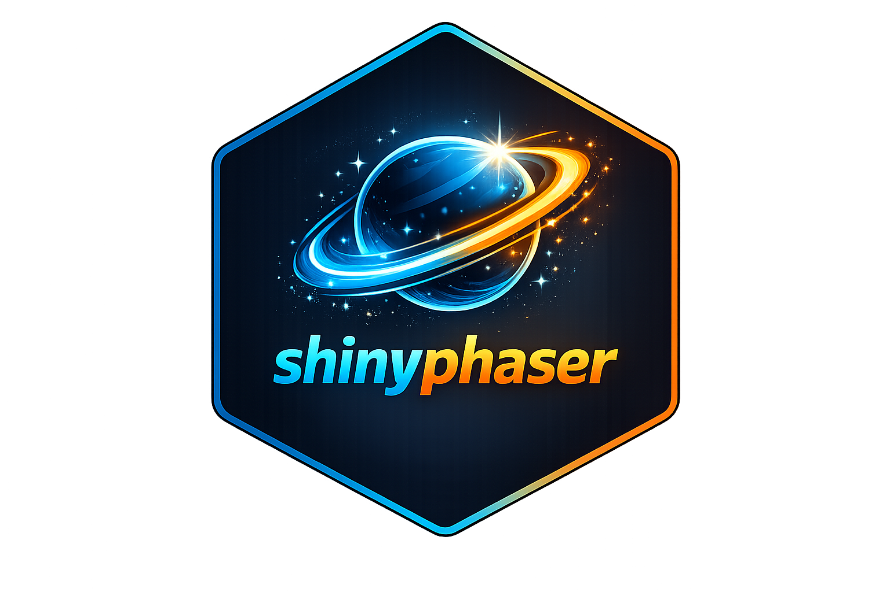

# shinyphaser 

This package provides an **R Shiny interface to selected features of the
[Phaser 3](https://phaser.io/) game framework**.

It is designed to expose a practical subset of Phaser 3 capabilities
inside Shiny apps, so you can build interactive game-like experiences
from R without needing to use the full JavaScript API directly.

## What you can do with shinyphaser

With the current API, you can build small-to-medium 2D game-like
interactions in Shiny, including:

- 🎮 creating a game canvas in your Shiny UI,
- 🧩 adding images and animated sprites,
- ⌨️ attaching keyboard-based player controls,
- 💥 defining overlap and collision rules between objects,
- 🔔 reacting to game events from R server logic.

## Phaser basics worth adding next

`shinyphaser` already covers a strong foundation (sprites, controls,
map, collision, overlap, and callbacks), but these Phaser basics would
unlock many more game patterns:

- 🎵 **Audio support** (load/play/pause/loop sound effects and music).
- 🎥 **Camera follow and zoom helpers** for player-centric worlds larger
  than one screen.
- 🧱 **Tilemap utility helpers** (object layers, spawn points, and easy
  collision-layer setup).
- 🧪 **Physics body configuration wrappers** (drag, max velocity,
  acceleration, immovable flags, and world gravity).
- 👆 **Pointer/touch input helpers** for mobile-friendly interactions.
- ✨ **Tween/easing wrappers** for polished movement and UI transitions.
- 🗂️ **Scene/state lifecycle hooks** (pause/resume/restart patterns for
  menus, level flow, and game-over handling).

## Installation

Install the stable release from CRAN:

``` r
install.packages("shinyphaser")
```

Install the development version from GitHub:

``` r
# install.packages("pak")
pak::pak("maciekbanas/shinyphaser")
```

## Quick start

You can run the built-in sample app:

``` r
shinyphaser::run_sample_app()
```

Or start from the example script:

``` r
file.edit(system.file("examples", "hedgehog_simple.R", package = "shinyphaser"))
```

## Learn by example

For a full walkthrough (from static background to movement, animation,
overlap, and collision), see the vignette:

- [**Build your first shinyphaser
  game**](https://maciekbanas.github.io/shinyphaser/articles/first-game.html)

## Example games created with `shinyphaser`

- [hedgehog](https://maciekbanas.shinyapps.io/hedgehog)
