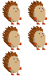
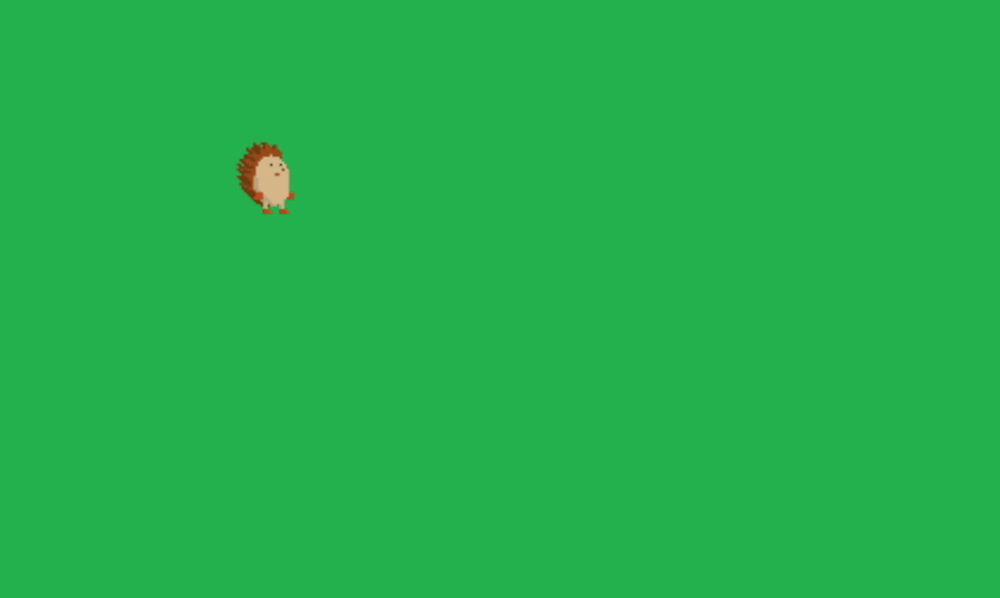
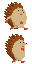
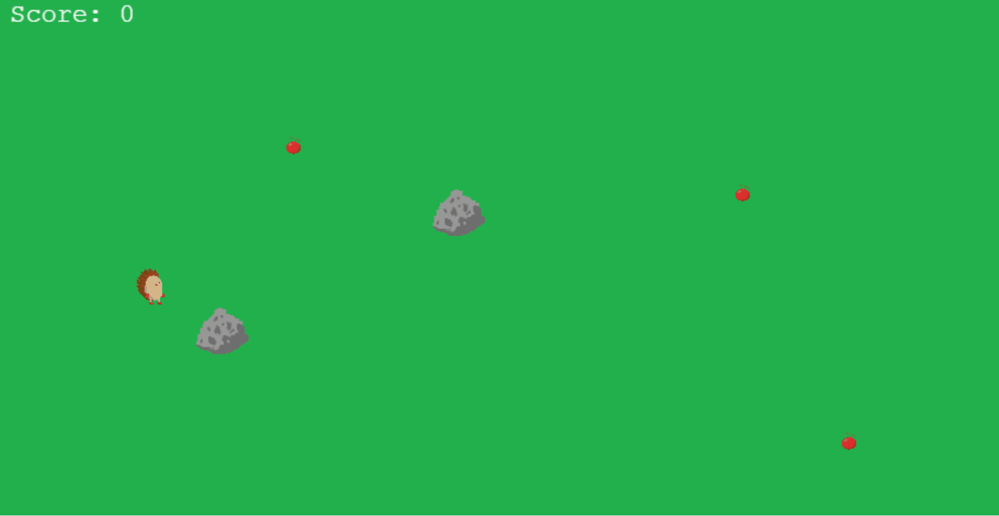
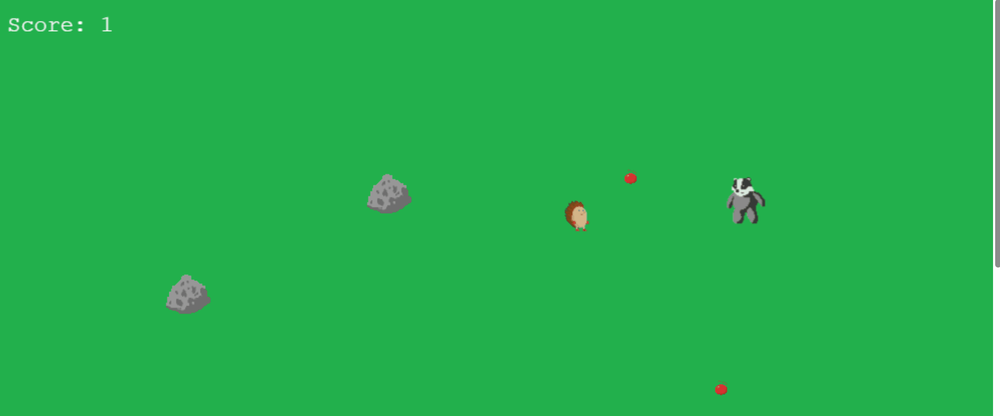

```{r, include = FALSE}
knitr::opts_chunk$set(
  collapse = TRUE,
  comment = "#>"
)
```

This vignette walks through a minimal **shinyphaser** game where a hedgehog:

- moves with arrow keys,
- plays animations,
- collects apples (overlap),
- collides with rocks,
- avoids enemy sprites.

## 1) Basic app structure: `ui` and `server` (why `width`/`height` set the play area and `set_shiny_session()` enables server-side events)

A shinyphaser game lives inside a regular Shiny app.

In `UI` we need to load `Phaser.js` dependencies and we do it with calling `ui()` method.

`set_shiny_session()` method is a helper to set Shiny session inside R6 object private environment as it will be reused by `shinyphaser` methods many times.

```{r eval=FALSE}
library(shiny)
library(shinyphaser)

game <- PhaserGame$new(width = 1500, height = 800)

ui <- tagList(
  game$ui()
)

server <- function(input, output, session) {
  game$set_shiny_session()
}

shinyApp(ui, server)
```

## 2) Add first image (background) (why `name` is a stable object key and `x`/`y` position the terrain center)

First we add simply image which will serve as a background to our game.

```{r eval=FALSE}
floor <- game$add_image(
  name = "floor",
  url = "assets/hedgehog/terrain/grass.png",
  x = 800,
  y = 300
)
```
<details>
<summary>Show full code</summary>
```{r eval=FALSE}
library(shiny)
library(shinyphaser)

game <- PhaserGame$new(width = 1500, height = 800)

ui <- tagList(
  game$ui()
)

server <- function(input, output, session) {
  game$set_shiny_session()

  floor <- game$add_image(
    name = "floor",
    url = "assets/hedgehog/terrain/grass.png",
    x = 800,
    y = 300
  )
}

shinyApp(ui, server)

```
</details>
```{r, echo=FALSE}

```

## 3) Add sprite (the player hedgehog) (why frame parameters describe spritesheet geometry and animation timing)

Create a player sprite from a sprite sheet.
```{r eval=FALSE}
hedgehog <- game$add_sprite(
  name = "hedgehog",
  url = "assets/hedgehog/sprites/hedgehog_32.png",
  x = 140,
  y = 260,
  frame_width = 32,
  frame_height = 32,
  frame_count = 5,
  frame_rate = 6
)
```

```{r, echo=FALSE}

```
<details>
<summary>Show full code</summary>
```{r eval=FALSE}
library(shiny)
library(shinyphaser)

game <- PhaserGame$new(width = 1500, height = 800)

ui <- tagList(
  game$ui()
)

server <- function(input, output, session) {
  game$set_shiny_session()

  floor <- game$add_image(
    name = "floor",
    url = "assets/hedgehog/terrain/grass.png",
    x = 800,
    y = 300
  )

  hedgehog <- game$add_sprite(
    name = "hedgehog",
    url = "assets/hedgehog/sprites/hedgehog_32.png",
    x = 140,
    y = 260,
    frame_width = 32,
    frame_height = 32,
    frame_count = 5,
    frame_rate = 6
  )
}

shinyApp(ui, server)
```
</details>
```{r, echo=FALSE}

```

## 4) Add player controls (why `directions` limits movement axes and `speed` sets motion responsiveness)

Attach keyboard movement to the sprite.

```{r eval=FALSE}
hedgehog$add_player_controls(
  directions = c("left", "right", "up", "down"),
  speed = 220
)
```
<details>
<summary>Show full code</summary>
```{r eval=FALSE}
library(shiny)
library(shinyphaser)

game <- PhaserGame$new(width = 1500, height = 800)

ui <- tagList(
  game$ui()
)

server <- function(input, output, session) {
  game$set_shiny_session()

  floor <- game$add_image(
    name = "floor",
    url = "assets/hedgehog/terrain/grass.png",
    x = 800,
    y = 300
  )

  hedgehog <- game$add_sprite(
    name = "hedgehog",
    url = "assets/hedgehog/sprites/hedgehog_32.png",
    x = 140,
    y = 260,
    frame_width = 32,
    frame_height = 32,
    frame_count = 5,
    frame_rate = 6
  )

  hedgehog$add_player_controls(
    directions = c("left", "right", "up", "down"),
    speed = 220
  )
}

shinyApp(ui, server)
```
</details>
```{r, echo=FALSE}
knitr::include_graphics("assets/first_game_4_player_controls.gif")
```

## 5) Add move animations (why we map per-direction animation suffixes to directional spritesheets)

We would like now to apply animation to our hedgehog when he moves.

```{r, echo=FALSE}

knitr::include_graphics("assets/hedgehog_move_left_32.png")
```

Add directional animations and play one as default.

```{r eval=FALSE}
moves <- c("move_left", "move_right", "move_up", "move_down")

for (move in moves) {
  hedgehog$add_animation(
    suffix = move,
    url = paste0("assets/hedgehog/sprites/hedgehog_", move, "_32.png"),
    frame_width = 32,
    frame_height = 32,
    frame_rate = 5
  )
}
```

<details>
<summary>Show full code</summary>
```{r eval=FALSE}
library(shiny)
library(shinyphaser)

game <- PhaserGame$new(width = 1500, height = 800)

ui <- tagList(
  game$ui()
)

server <- function(input, output, session) {
  game$set_shiny_session()

  floor <- game$add_image(
    name = "floor",
    url = "assets/hedgehog/terrain/grass.png",
    x = 800,
    y = 300
  )

  hedgehog <- game$add_sprite(
    name = "hedgehog",
    url = "assets/hedgehog/sprites/hedgehog_32.png",
    x = 140,
    y = 260,
    frame_width = 32,
    frame_height = 32,
    frame_count = 5,
    frame_rate = 6
  )

  hedgehog$add_player_controls(
    directions = c("left", "right", "up", "down"),
    speed = 220
  )

  moves <- c("move_left", "move_right", "move_up", "move_down")

  for (move in moves) {
    hedgehog$add_animation(
      suffix = move,
      url = paste0("assets/hedgehog/sprites/hedgehog_", move, "_32.png"),
      frame_width = 32,
      frame_height = 32,
      frame_rate = 5
    )
  }
}

shinyApp(ui, server)
```
</details>

```{r, echo=FALSE}
knitr::include_graphics("assets/first_game_5_move_animation.gif")
```

## 6) Add overlap with other objects (collect apples) (why overlap is non-blocking and ideal for pickups + score callbacks)

Use overlap when two objects can share space and trigger events.

```{r eval=FALSE}
score <- reactiveVal(0)
apples <- game$add_static_group("apples", "assets/hedgehog/perks/apple_20.png")

apples$create(260, 140)
apples$create(640, 180)
apples$create(730, 390)

score_text <- game$add_text(text = "Score: 0", id = "score", x = 20, y = 20)

game$add_overlap(
  object_name = "hedgehog",
  group_name = "apples",
  callback_fun = function(evt) {
    apples$disable(evt)        # hide collected apple
    score(score() + 1)
    score_text$set(paste("Score:", score()))
  },
  input = input
)
```

<details>
<summary>Show full code</summary>
```{r eval=FALSE}
library(shiny)
library(shinyphaser)

game <- PhaserGame$new(width = 1500, height = 800)

ui <- tagList(
  game$ui()
)

server <- function(input, output, session) {
  game$set_shiny_session()

  floor <- game$add_image(
    name = "floor",
    url = "assets/hedgehog/terrain/grass.png",
    x = 800,
    y = 300
  )

  hedgehog <- game$add_sprite(
    name = "hedgehog",
    url = "assets/hedgehog/sprites/hedgehog_32.png",
    x = 140,
    y = 260,
    frame_width = 32,
    frame_height = 32,
    frame_count = 5,
    frame_rate = 6
  )

  hedgehog$add_player_controls(
    directions = c("left", "right", "up", "down"),
    speed = 220
  )

  moves <- c("move_left", "move_right", "move_up", "move_down")

  for (move in moves) {
    hedgehog$add_animation(
      suffix = move,
      url = paste0("assets/hedgehog/sprites/hedgehog_", move, "_32.png"),
      frame_width = 32,
      frame_height = 32,
      frame_rate = 5
    )
  }

  score <- reactiveVal(0)
  apples <- game$add_static_group("apples", "assets/hedgehog/perks/apple_20.png")

  apples$create(260, 140)
  apples$create(640, 180)
  apples$create(730, 390)

  score_text <- game$add_text(text = "Score: 0", id = "score", x = 20, y = 20)

  game$add_overlap(
    object_name = "hedgehog",
    group_name = "apples",
    callback_fun = function(evt) {
      apples$disable(evt)        # hide collected apple
      score(score() + 1)
      score_text$set(paste("Score:", score()))
    },
    input = input
  )
}
shinyApp(ui, server)
```
</details>

```{r, echo=FALSE}
knitr::include_graphics("assets/first_game_6_overlap.gif")
```

## 7) Add collision with other objects (rocks) (why collision creates blocking physics and uses static groups for obstacles)

Use collision when objects should block each other.

```{r eval=FALSE}
game$enable_terrain_collision("hedgehog")

rocks <- game$add_static_group(
  name = "rocks",
  url = "assets/hedgehog/obstacles/rock.png"
)

rocks$create(
  x = 400,
  y = 400
)
rocks$create(
  x = 600,
  y = 500
)
```

```{r eval=FALSE}
game$add_collider(
  object_name = "hedgehog",
  group_name = "rocks"
)
```

<details>
<summary>Show full code</summary>
```{r eval=FALSE}
library(shiny)
library(shinyphaser)

game <- PhaserGame$new(width = 1500, height = 800)

ui <- tagList(
  game$ui()
)

server <- function(input, output, session) {
  game$set_shiny_session()

  floor <- game$add_image(
    name = "floor",
    url = "assets/hedgehog/terrain/grass.png",
    x = 800,
    y = 300
  )

  hedgehog <- game$add_sprite(
    name = "hedgehog",
    url = "assets/hedgehog/sprites/hedgehog_32.png",
    x = 140,
    y = 260,
    frame_width = 32,
    frame_height = 32,
    frame_count = 5,
    frame_rate = 6
  )

  hedgehog$add_player_controls(
    directions = c("left", "right", "up", "down"),
    speed = 220
  )

  game$enable_terrain_collision("hedgehog")

  moves <- c("move_left", "move_right", "move_up", "move_down")

  for (move in moves) {
    hedgehog$add_animation(
      suffix = move,
      url = paste0("assets/hedgehog/sprites/hedgehog_", move, "_32.png"),
      frame_width = 32,
      frame_height = 32,
      frame_rate = 5
    )
  }

  score <- reactiveVal(0)
  apples <- game$add_static_group("apples", "assets/hedgehog/perks/apple_20.png")

  apples$create(260, 140)
  apples$create(640, 180)
  apples$create(730, 390)

  rocks <- game$add_static_group(
    name = "rocks",
    url = "assets/hedgehog/obstacles/rock.png"
  )

  rocks$create(400, 200)
  rocks$create(200, 300)

  score_text <- game$add_text(text = "Score: 0", id = "score", x = 20, y = 20)

  game$add_overlap(
    object_name = "hedgehog",
    group_name = "apples",
    callback_fun = function(evt) {
      apples$disable(evt)        # hide collected apple
      score(score() + 1)
      score_text$set(paste("Score:", score()))
    },
    input = input
  )

  game$add_collider(
    object_name = "hedgehog",
    group_name = "rocks"
  )
}
shinyApp(ui, server)
```
</details>

```{r, echo=FALSE}

```

## 8) Add enemy sprites (why periodic `set_in_motion()` with `dir_x`/`dir_y` creates simple patrol behavior)

Create one or more enemies and move them. If enemy overlaps the player, end game.

```{r eval=FALSE}
enemy <- game$add_sprite(
  name = "badger",
  url = "assets/hedgehog/sprites/badger_move_left_50.png",
  x = 700,
  y = 300,
  frame_width = 50,
  frame_height = 50,
  frame_count = 1,
  frame_rate = 1
)

game$add_overlap(
  object_name = "hedgehog",
  object_two = "badger",
  callback_fun = function(evt) {
    shinyalert::shinyalert(
      title = "Game over", type = "error",
      closeOnClickOutside = FALSE, showCancelButton = FALSE,
      callbackR = function(value) shiny::stopApp()
    )
  },
  input = input
)

shiny::observe({
  shiny::invalidateLater(700, session)
  dir <- sample(list(c(-1, 0), c(1, 0), c(0, -1), c(0, 1)), 1)[[1]]
  enemy$set_in_motion(
    dir_x = dir[1],
    dir_y = dir[2],
    speed = 70,
    distance = 150,
    lag = 0
  )
})
```

```{r, echo=FALSE}

```

## 9) Full minimal app (why combining overlap, collision, and animation produces complete game loop behavior)

Put all pieces together:

```{r eval=FALSE}
library(shiny)
library(shinyphaser)

game <- PhaserGame$new(width = 1500, height = 800)

ui <- tagList(
  game$ui()
)

server <- function(input, output, session) {
  game$set_shiny_session()

  floor <- game$add_image(
    name = "floor",
    url = "assets/hedgehog/terrain/grass.png",
    x = 800,
    y = 300
  )

  hedgehog <- game$add_sprite(
    name = "hedgehog",
    url = "assets/hedgehog/sprites/hedgehog_32.png",
    x = 140,
    y = 260,
    frame_width = 32,
    frame_height = 32,
    frame_count = 5,
    frame_rate = 6
  )

  hedgehog$add_player_controls(
    directions = c("left", "right", "up", "down"),
    speed = 220
  )

  game$enable_terrain_collision("hedgehog")

  moves <- c("move_left", "move_right", "move_up", "move_down")

  for (move in moves) {
    hedgehog$add_animation(
      suffix = move,
      url = paste0("assets/hedgehog/sprites/hedgehog_", move, "_32.png"),
      frame_width = 32,
      frame_height = 32,
      frame_rate = 5
    )
  }

  score <- reactiveVal(0)
  apples <- game$add_static_group("apples", "assets/hedgehog/perks/apple_20.png")

  apples$create(260, 140)
  apples$create(640, 180)
  apples$create(730, 390)

  rocks <- game$add_static_group(
    name = "rocks",
    url = "assets/hedgehog/obstacles/rock.png"
  )

  rocks$create(400, 200)
  rocks$create(200, 300)

  score_text <- game$add_text(text = "Score: 0", id = "score", x = 20, y = 20)

  game$add_overlap(
    object_name = "hedgehog",
    group_name = "apples",
    callback_fun = function(evt) {
      apples$disable(evt)
      score(score() + 1)
      score_text$set(paste("Score:", score()))
    },
    input = input
  )

  game$add_collider(
    object_name = "hedgehog",
    group_name = "rocks"
  )

  enemy <- game$add_sprite(
    name = "badger",
    url = "assets/hedgehog/sprites/badger_move_left_50.png",
    x = 700,
    y = 300,
    frame_width = 50,
    frame_height = 50,
    frame_count = 1,
    frame_rate = 1
  )

  game$add_overlap(
    object_name = "hedgehog",
    object_two = "badger",
    callback_fun = function(evt) {
      shinyalert::shinyalert(
        title = "Game over", type = "error",
        closeOnClickOutside = FALSE, showCancelButton = FALSE,
        callbackR = function(value) shiny::stopApp()
      )
    },
    input = input
  )

  shiny::observe({
    shiny::invalidateLater(700, session)
    dir <- sample(list(c(-1, 0), c(1, 0), c(0, -1), c(0, 1)), 1)[[1]]
    enemy$set_in_motion(
      dir_x = dir[1],
      dir_y = dir[2],
      speed = 70,
      distance = 150,
      lag = 0
    )
  })
}
shinyApp(ui, server)
```
